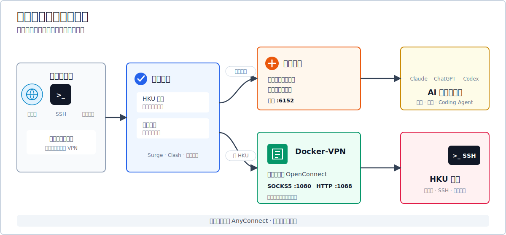
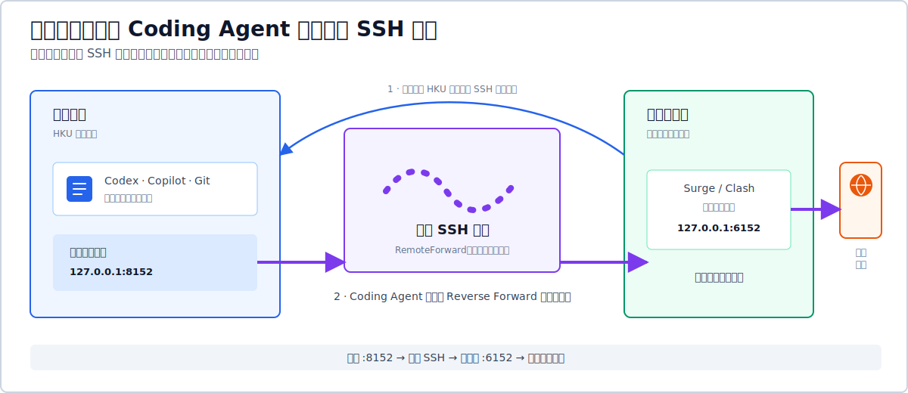

# Docker-VPN（HKU 版）

[English](Readme.md) | [简体中文](README.zh-CN.md)

在 Docker 容器内连接香港大学 VPN，再把隧道作为本地代理使用，让你自己决定哪些应用、网站和校内服务经过 HKU。

**要解决的问题：** 使用系统级 Cisco AnyConnect 时，网络路由会由 VPN 配置接管。当你一边需要访问 HKU Library、校园 SSH 或远程桌面，一边又需要让其他应用继续使用普通网络或现有代理服务时，频繁开关全局 VPN 很不方便，也容易产生路由冲突。

**Docker-VPN 的做法：** 在隔离容器内运行 OpenConnect，并把 HKU 隧道导出为仅本机可访问的 SOCKS5 和 HTTP 端口。浏览器、命令行、Surge/Clash 规则、SSH 配置或远程桌面目标规则决定哪些流量进入 HKU；主机默认路由保持不变。

> **快速使用：** 运行 `hkuvpn`，输入 Authenticator 当前六位验证码，然后使用 SOCKS5 `127.0.0.1:1080` 或 HTTP `127.0.0.1:1088`。



默认监听端口：

| 协议 | 地址 | 用途 |
|---|---|---|
| SOCKS5 | `127.0.0.1:1080` | 应用和 SSH 首选 |
| HTTP | `127.0.0.1:1088` | 不支持 SOCKS 的 HTTP/HTTPS 客户端 |

## 目录

- [可以用它做什么](#可以用它做什么)
- [常见使用方式](#常见使用方式)
- [工作原理](#工作原理)
- [兼容性与版本](#兼容性与版本)
- [准备条件](#准备条件)
- [安装](#安装)
- [日常命令](#日常命令)
- [使用本地 HKU 代理](#使用本地-hku-代理)
- [Surge 分流规则](#surge-分流规则)
- [经 HKU 使用 SSH 和远程桌面](#经-hku-使用-ssh-和远程桌面)
- [把本机代理提供给学校电脑](#把本机代理提供给学校电脑)
- [高级稳定性配置](#高级稳定性配置)
- [常见故障](#常见故障)
- [安全说明](#安全说明)
- [便携核心与可选自动化](#便携核心与可选自动化)
- [来源与许可证](#来源与许可证)

## 可以用它做什么

- 访问 HKU 网站和图书馆资源，同时避免无关流量进入学校 VPN。
- 保持 Surge、Clash、sing-box 或其他现有代理服务在线，让 HKU 流量使用独立路径。
- 通过本地 HKU 代理连接校内 SSH 和远程桌面主机。
- 通过只绑定回环地址的 SSH Remote Forward，把客户端代理提供给学校电脑上的 Coding Agent。
- 在 Colima、Docker Desktop 或原生 Docker 环境中，通过 Zsh、Bash 或 Fish 使用同一启动器。
- 查看状态、停止隧道，或者只恢复 Colima/Docker 后端，避免无意义地重复发起 MFA。

本项目不是通用匿名 VPN，不代替你原有的互联网代理，也不应被用于违反学校或服务商的使用政策。

## 常见使用方式

| 场景 | 推荐方式 |
|---|---|
| 本机访问 HKU Library 或校内网站 | 只把 HKU 域名发到 `1080` 或 `1088` |
| SSH 或远程桌面连接校内电脑 | 只把目标校园 IP/网段发到 HKU |
| 本机使用 ChatGPT、Claude、Codex、Copilot | 继续使用原有外部代理组，不经过 HKU |
| Coding Agent 运行在学校电脑 | 把本机代理反向转发到远端回环端口 `8152` |
| 两台电脑都在香港，而订阅只接受大陆入口 | 更换支持的入口，或把代理客户端放到可达的大陆主机；反向 SSH 本身不会改变入口位置 |

## 工作原理

1. 浏览器、命令行、SSH 配置或规则代理客户端先判断目标是否需要 HKU。
2. 被选中的流量进入本机 SOCKS5 或 HTTP 监听端口，再到达 `vpn-hku` 容器。
3. OpenConnect 把这些流量送入 HKU AnyConnect 隧道；其余流量继续使用原来的直连或代理路径。

这里的 Cisco AnyConnect 指服务端协议。HKU 连接并不启动 Cisco 官方桌面客户端，而是由容器内的 OpenConnect 建立，因此不会修改主机的全局默认路由。

## 兼容性与版本

| 范围 | 当前支持情况 |
|---|---|
| macOS 容器环境 | Colima 或 Docker Desktop |
| Linux 容器环境 | Docker Engine |
| Windows | Docker Desktop + WSL2；由社区测试 |
| Shell | Zsh、Bash 和 Fish |
| 规则代理客户端 | 提供 Surge 示例；Clash/Mihomo、sing-box 等可采用同一分流模型 |
| 当前 `alpine:3.23` 镜像内 OpenConnect | 9.12 |

OpenConnect 在镜像内运行，因此不会使用主机上通过 Homebrew 安装的 OpenConnect。当前镜像跟随 Alpine 3.23 软件包；排查版本相关问题时，请查看 [OpenConnect 官方 Releases](https://gitlab.com/openconnect/openconnect/-/releases)。

## 准备条件

- 已开通 VPN 权限的 HKU 账号。
- HKU Portal 静态 PIN 和 Microsoft Authenticator 当前验证码。
- Docker Engine、Docker Desktop 或 Colima。
- macOS 默认具备、常见 Linux 发行版可安装的 `openssl`。
- 只有选择 Fish 包装函数时才需要 Fish。
- 只有建立常驻反向隧道时才需要 `autossh`。

## 安装

### 1. 安装 Docker runtime

macOS 推荐 Colima：

```bash
brew install colima docker
colima start --cpu 2 --memory 2 --disk 20 --vm-type vz --mount-type virtiofs
docker info
```

Docker Desktop 也可以使用。Linux 可安装 Docker Engine；Windows 可在 WSL2 内运行启动器，并启用 Docker Desktop 的 WSL integration。

### 2. 克隆并构建

```bash
git clone https://github.com/rqhu1995/docker-vpn.git ~/docker-vpn
cd ~/docker-vpn
docker build -t local/vpn .
```

确认镜像实际安装的 OpenConnect 版本：

```bash
docker run --rm --entrypoint openconnect local/vpn --version
```

### 3. 创建私有配置

```bash
mkdir -p ~/.vpn
cp ~/docker-vpn/examples/hku.env.example ~/.vpn/hku.env
printf '%s' 'YOUR_PORTAL_PIN' > ~/.vpn/hku.pass
chmod 600 ~/.vpn/hku.pass
```

编辑 `~/.vpn/hku.env`：

```ini
HKU_USER=youruid@connect.hku.hk
HKU_ENDPOINT=hk
```

账号格式以 HKU 实际分配为准。不要把静态 PIN、MFA 验证码、订阅信息或 SSH 私钥放进仓库。

### 4. 安装 Shell 包装函数

Zsh：

```bash
printf '\nsource ~/docker-vpn/examples/hkuvpn.zsh\n' >> ~/.zshrc
source ~/.zshrc
```

Bash：

```bash
printf '\nsource ~/docker-vpn/examples/hkuvpn.zsh\n' >> ~/.bashrc
source ~/.bashrc
```

Fish：

```fish
mkdir -p ~/.config/fish/functions
cp ~/docker-vpn/examples/hkuvpn.fish ~/.config/fish/functions/hkuvpn.fish
fish -n ~/.config/fish/functions/hkuvpn.fish
```

不要把 Zsh 函数直接贴进 Fish。Fish 不使用 `export`、`VAR=value command`、POSIX `case` 和 POSIX 函数语法。

仓库不在 `~/docker-vpn` 时：

```bash
export DOCKER_VPN_HOME=/path/to/docker-vpn        # Zsh/Bash
```

```fish
set -Ux DOCKER_VPN_HOME /path/to/docker-vpn      # Fish
```

## 日常命令

```bash
hkuvpn              # 使用 ~/.vpn/hku.env 的默认入口
hkuvpn cn           # HKU 大陆入口
hkuvpn hk           # HKU 香港入口
hkuvpn --status
hkuvpn --stop
hkuvpn --recover    # 只修复 Docker/Colima，不发起 MFA
```

出现 `Response:` 后输入 Authenticator 当前六位验证码。使用期间保持终端开启；按 `Ctrl+C` 可停止前台容器。

| 参数 | 入口 | 通常适用位置 |
|---|---|---|
| `cn` | HKU 大陆入口地址 | 客户端在中国大陆 |
| `hk` | `vpn2fa.hku.hk` | 客户端在香港或海外 |

最终应以实际可达性为准。如果证书获取或 TLS 失败，应测试另一个入口，并检查现有代理客户端为控制连接选了什么路径。

## 使用本地 HKU 代理

在第二个终端测试：

```bash
curl -x socks5h://127.0.0.1:1080 -I https://www.hku.hk/
curl -x http://127.0.0.1:1088 -I https://www.hku.hk/
```

需要通过代理解析 DNS 时使用 `socks5h`，不要使用 `socks5`。Docker 当前发布的是 TCP 端口，不应把该方案宣传为通用 UDP 代理。

单条命令使用 HKU 代理：

```bash
ALL_PROXY=socks5h://127.0.0.1:1080 curl https://lib.hku.hk/   # Zsh/Bash
```

Fish：

```fish
env ALL_PROXY=socks5h://127.0.0.1:1080 curl https://lib.hku.hk/
begin
    set -lx ALL_PROXY socks5h://127.0.0.1:1080
    curl https://lib.hku.hk/
end
```

默认端口冲突时，修改 `~/.vpn/hku.env`：

```ini
HKU_SOCKS_PORT=11080
HKU_HTTP_PORT=11088
```

## Surge 分流规则

把 [examples/surge.conf](examples/surge.conf) 合并到现有配置，不要用示例覆盖整份 Surge 配置。关键顺序如下：

1. HKU VPN 控制入口必须走 HKU 本地代理之外的路径，否则连接会在隧道尚未建立时进入自身隧道。
2. 只有明确的校园网段和 HKU 服务进入 `HKU` 组。
3. AI、普通外部流量和最终规则继续走原有代理组。

最小示例：

```ini
[Proxy]
HKU-SOCKS5 = socks5, 127.0.0.1, 1080
HKU-HTTP = http, 127.0.0.1, 1088

[Proxy Group]
HKU = select, HKU-SOCKS5, HKU-HTTP, EXISTING-PROXY, DIRECT
HKU-CONTROL = select, DIRECT, EXISTING-PROXY

[Rule]
DOMAIN,vpn2fa.hku.hk,HKU-CONTROL
IP-CIDR,121.37.195.197/32,HKU-CONTROL,no-resolve
# IP-CIDR,<精确校园网段>,HKU,no-resolve
DOMAIN-SUFFIX,hku.hk,HKU
DOMAIN-SUFFIX,hku.edu.hk,HKU
```

不要直接把整个 `10.0.0.0/8` 发到 HKU；家庭、公司和容器网络经常也使用该地址段。只添加服务实际使用的最小校园网段。

所选入口可以直接到达时，`HKU-CONTROL` 选择 `DIRECT`；只有现有外部代理确实能够到达该入口时才选择 `EXISTING-PROXY`。控制组绝不能选择 `HKU-SOCKS5` 或 `HKU-HTTP`。

Clash/Mihomo、sing-box、Quantumult X、Loon 等支持本地上游和有序规则的客户端也采用同一原理：语法可以不同，但 VPN 控制连接和 HKU 数据流必须分开。

## 经 HKU 使用 SSH 和远程桌面

校内主机只能通过 HKU 到达时，合并并修改 [examples/ssh_config.example](examples/ssh_config.example)：

```sshconfig
Host campus-host
  HostName 10.0.0.10
  User yourname
  ProxyCommand nc -X 5 -x 127.0.0.1:1080 %h %p
  ServerAliveInterval 30
  ServerAliveCountMax 3
```

以后正常执行：

```bash
ssh campus-host
```

远程桌面建议在 Surge Enhanced Mode 中按精确目标 IP 发到 HKU 组，或者使用原生支持 SOCKS 的客户端。macOS 可以额外设置进程规则，但目标地址规则通常更稳定、更容易验证。

## 把本机代理提供给学校电脑

当 Coding Agent 运行在学校电脑，而付费节点只允许位于大陆的客户端接入时，可把大陆电脑上已经工作的 Surge/Clash 端口反向转发给学校电脑。

### 流量方向



虽然选项叫 `RemoteForward`，SSH 控制连接仍由客户端主动建立。`-R` 在远端电脑创建监听端口，再把每个连接经 SSH 带回客户端可见的目标地址。

### SSH 配置

```sshconfig
Host campus-host-tunnel
  HostName 10.0.0.10
  User yourname
  ProxyCommand nc -X 5 -x 127.0.0.1:1080 %h %p
  RemoteForward 127.0.0.1:8152 127.0.0.1:6152
  ExitOnForwardFailure yes
  ServerAliveInterval 30
  ServerAliveCountMax 3
```

显式写出远端 `127.0.0.1` 是安全要求。OpenSSH 默认也只绑定回环地址，但明确配置可以避免服务器日后修改 `GatewayPorts` 后意外成为校园网开放代理。

启动并验证：

```bash
ssh -N campus-host-tunnel
ssh campus-host 'curl -x http://127.0.0.1:8152 -I https://www.apple.com/'
```

远端电脑应尽量只给目标进程设置代理：

```bash
HTTP_PROXY=http://127.0.0.1:8152 \
HTTPS_PROXY=http://127.0.0.1:8152 \
NO_PROXY=localhost,127.0.0.1 \
codex
```

Fish：

```fish
begin
    set -lx HTTP_PROXY http://127.0.0.1:8152
    set -lx HTTPS_PROXY http://127.0.0.1:8152
    set -lx NO_PROXY localhost,127.0.0.1
    codex
end
```

如果只是使用 ChatGPT 或 Claude 网页，通常直接在本机浏览器打开即可，不需要反向隧道。当 Codex、Copilot、包管理器或 Git 进程实际运行在学校电脑上时，才需要该端口。

### 保持隧道在线

```bash
brew install autossh
autossh -M 0 -N campus-host-tunnel
```

`-M 0` 表示使用 SSH 配置里的 ServerAlive 机制。macOS 可把命令放入用户 LaunchAgent。`autossh` 进程仍在运行不等于隧道一定健康，必须从远端用 `curl` 验证 `127.0.0.1:8152`。

如果 SSH 客户端和代理客户端也都在香港，而订阅只允许大陆入口，这个方案并不能解决问题，因为代理入口仍是监听 `6152` 的那台机器。此时应把代理客户端放到可达的大陆电脑/VPS，或购买支持的入口。

## 高级稳定性配置

### OpenConnect 重连

容器入口现在启用详细时间戳和 30 分钟重连窗口。断连仍可能以 `CSTP Dead Peer Detection detected dead peer`、TLS read error、`Host is unreachable` 或 cookie 被拒绝结束。

如果重连后立即出现 `401 Unauthorized` 或 cookie rejected，可能是 DNS 把已认证会话切到了另一个 HKU 后端。高级用户可以在单次会话固定真实网关：

```ini
HKU_RESOLVE=vpn2fa.hku.hk:REAL_IP
```

只能使用真实 DNS 或代理客户端真实 DNS cache 得到的 IP；不要使用 Enhanced Mode 的 `198.18.0.0/15` fake IP。HKU 基础设施变化后应重新核对，过期固定地址会直接造成断连。

### Colima 恢复层级

1. 用 `docker info` 检查主机 Docker socket，不能只看 `colima status`。
2. 用 `hkuvpn --recover` 启动或重启 Colima，同时避免重复发起 MFA。
3. 用 `colima ssh -- docker info` 区分“虚拟机内 Docker 正常”和“主机 socket 转发损坏”。
4. VZ 或磁盘挂载问题查看 `~/.colima/_lima/colima/ha.stderr.log`。
5. 只有控制面卡死时才使用 `colima stop --force`；macOS 可能需要一到数分钟释放 VZ 磁盘，再启动才会成功。

`colima delete` 会删除本地镜像和容器，应当是最后手段，不是默认排查命令。

### 不依赖 Surge

便携启动器不会默认执行 Surge 自动重载或策略切换，因为用户也可能使用 Clash、sing-box 或完全不使用代理客户端。自行自动化时应保持三条约束：

- HKU 隧道失效时，把 HKU 流量切到明确的 fallback，例如 `DIRECT` 或已有香港线路。
- `vpn2fa.hku.hk` 和大陆入口绝不能进入 `HKU-SOCKS5`。
- 只有 `1080/1088` 监听和 VPN 隧道都确认健康后，才恢复 HKU 组。

## 常见故障

### tmux/终端会话立即消失

先查 Docker。Colima 主机 socket 不可用时，启动器可能在出现 MFA 之前退出：

```bash
docker info
colima status
hkuvpn --recover
```

### 无法获取证书

分别测试 `hkuvpn cn` 和 `hkuvpn hk`，检查 VPN 控制入口规则。确认入口无误后，只删除对应 cache：

```bash
rm ~/.vpn/pin-hk.cache
```

### 端口被占用

```bash
lsof -nP -iTCP:1080 -sTCP:LISTEN
```

在 `~/.vpn/hku.env` 选择其他主机端口，并同步修改代理客户端配置。

### 容器在线但服务不可用

逐层测试：

```bash
docker ps --filter name=vpn-hku
hkuvpn --status
curl -x socks5h://127.0.0.1:1080 -I https://www.hku.hk/
ssh -G campus-host | grep -E 'proxycommand|hostname|port'
```

仅看到 `autossh` 进程或 `colima status` 正常，不构成端到端成功证据。

## 安全说明

- 本地代理只绑定主机回环地址。没有认证和防火墙时不要发布到 `0.0.0.0`。
- Remote Forward 也只绑定远端回环地址；本场景不要启用 `GatewayPorts yes`。
- `~/.vpn/hku.pass` 是明文，权限应为 `600`，电脑应启用全盘加密。
- 有 Docker 权限的用户可查看容器环境变量，应把 Docker 权限视为高权限。
- 容器需要 `NET_ADMIN` 和 `/dev/net/tun`，重建前应审查代码，不使用来历不明的镜像。
- 不要在 issue 或 commit 中提交真实校园主机、账号、证书 cache、日志、订阅 URL 和 SSH 私钥。

## 便携核心与可选自动化

Docker-VPN 的便携核心包括启动器、Shell 包装函数、路由示例和容器入口，不依赖 Surge、tmux 或某一个特定终端应用。

需要无人值守或长期运行时，可以按实际环境加入代理客户端 CLI 自动化、tmux 监控、macOS LaunchAgent 等系统服务，以及 `~/.vpn/logs/` 诊断日志。这些集成应保持可选和机器相关，确保基础 HKU 代理仍能配合其他代理客户端和 Docker 环境使用。

## 来源与许可证

本项目基于 [ethack/docker-vpn](https://github.com/ethack/docker-vpn)，针对 HKU、OpenConnect MFA 和本机回环代理进行了改造。

仓库目前没有明确的 `LICENSE` 文件。Fork 并不自动产生授权；维护者应在邀请重新分发或外部贡献前选择兼容许可证，并加入完整许可证文本。
