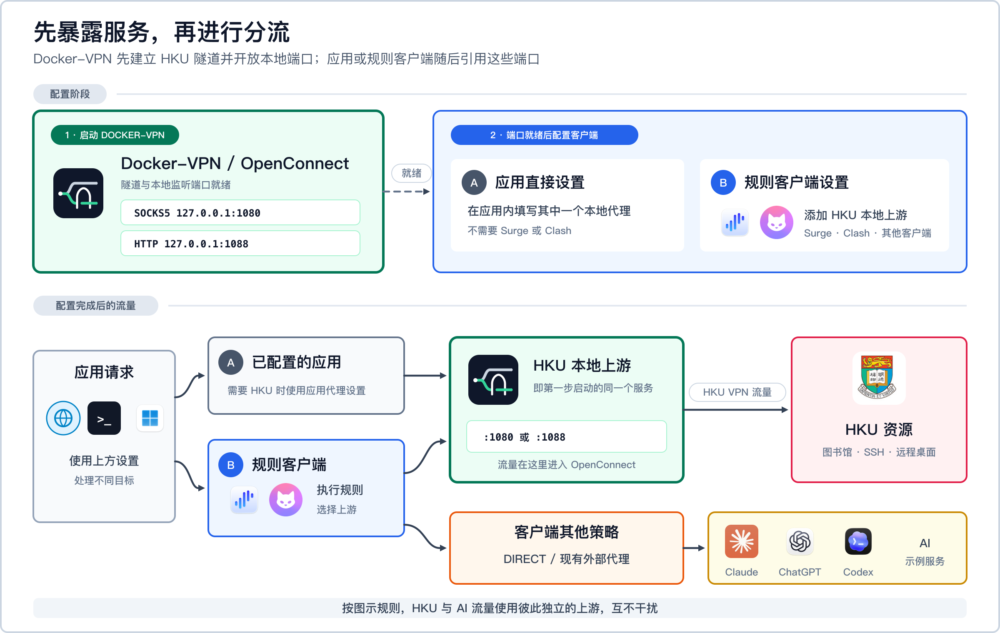
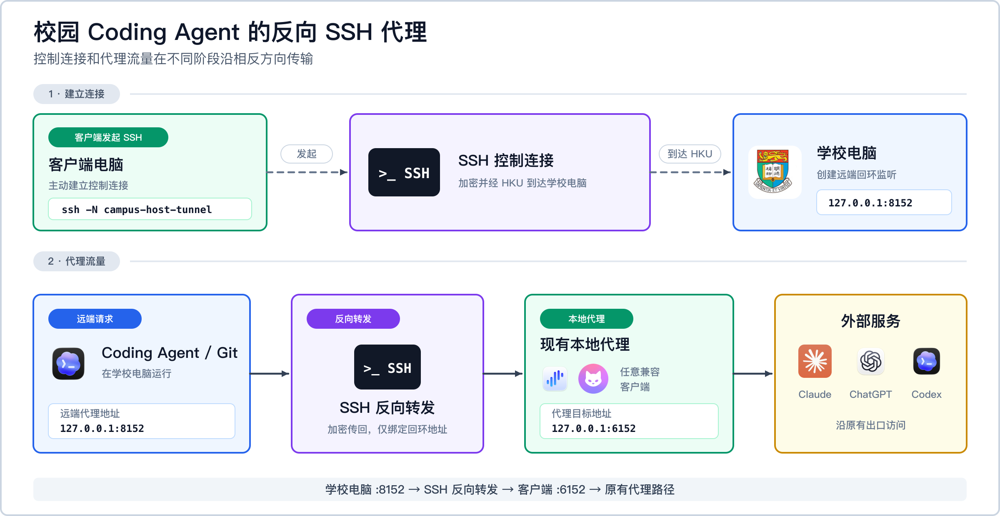

#  Docker-VPN（HKU 版）

[English](Readme.md) | [简体中文](README.zh-CN.md)

在 Docker 容器内连接香港大学 VPN，再把隧道作为本地代理使用，让你自己决定哪些应用、网站和校内服务经过 HKU。

**要解决的问题：** 使用系统级 Cisco AnyConnect 时，网络路由会由 VPN 配置接管。当你一边需要访问 HKU Library、校园 SSH 或远程桌面，一边又需要让其他应用继续使用普通网络或现有代理服务时，频繁开关全局 VPN 很不方便，也容易产生路由冲突。

**Docker-VPN 的做法：** 在隔离容器内运行 OpenConnect，并把 HKU 隧道导出为仅本机可访问的 SOCKS5 和 HTTP 端口。应用可以直接使用这些端口，也可以由 Surge、Clash 等可选的分流客户端引用。Docker-VPN 不决定任何非 HKU 流量的去向，主机默认路由保持不变。

> **第一次使用的目标：** 按照[快速上手](#快速上手)完成连接，直到测试命令能够通过 HKU 返回 HTTP 响应头。基础连接成功前，不需要配置 Clash、Surge、SSH 或远程桌面。

## 目录

- [快速上手](#快速上手)
- [使用 Docker-VPN](#使用-docker-vpn)
- [远程访问](#远程访问)
- [运行维护与故障排查](#运行维护与故障排查)
- [项目参考](#项目参考)

## 快速上手

这一节包含首次运行所需的完整步骤，不需要规则客户端。

### 开始前准备

- 已开通 VPN 权限的 HKU 账号。
- HKU Portal 静态 PIN 和 Microsoft Authenticator 当前验证码。
- macOS 默认具备、常见 Linux 发行版可安装的 `openssl`。
- 一个可用的 Docker 环境。下面以推荐的 macOS 方案为主；Docker Desktop、Linux Docker Engine 和 Windows WSL2 也可以使用。

### 1. 启动 Docker

macOS 推荐 Colima：

```bash
brew install colima docker
colima start --cpu 2 --memory 2 --disk 20 --vm-type vz --mount-type virtiofs
docker info
```

Docker Desktop 也可以使用。Linux 可安装 Docker Engine；Windows 可在 WSL2 内运行启动器，并启用 Docker Desktop 的 WSL integration。

### 2. 克隆并构建

```bash
git clone https://github.com/rqhu1995/docker-vpn.git ~/docker-vpn
cd ~/docker-vpn
docker build -t local/vpn .
```

### 3. 创建私有配置

```bash
mkdir -p ~/.vpn
cp ~/docker-vpn/examples/hku.env.example ~/.vpn/hku.env
printf '%s' 'YOUR_PORTAL_PIN' > ~/.vpn/hku.pass
chmod 600 ~/.vpn/hku.pass
```

执行第三条命令前，先把 `YOUR_PORTAL_PIN` 替换为自己的 HKU Portal 静态 PIN。这里保存的不是 Authenticator 当前六位验证码。

用文本编辑器打开 `~/.vpn/hku.env`，例如：

```bash
nano ~/.vpn/hku.env
```

把示例账号替换为自己的账号：

```ini
HKU_USER=youruid@connect.hku.hk
HKU_ENDPOINT=hk
```

账号格式以 HKU 实际分配为准。在 Nano 中依次按 `Ctrl+O`、`Enter`、`Ctrl+X` 保存并退出。不要把静态 PIN、MFA 验证码、订阅信息或 SSH 私钥放进仓库。

### 4. 建立连接

按照当前位置选择其中一条命令：

```bash
~/docker-vpn/bin/hkuvpn hk    # 香港或海外
~/docker-vpn/bin/hkuvpn cn    # 中国大陆
```

出现 `Response:` 后输入 Authenticator 当前六位验证码。使用期间保持这个终端开启；按 `Ctrl+C` 可停止连接。

### 5. 验证连接

打开第二个终端并执行：

```bash
curl -x socks5h://127.0.0.1:1080 -I https://www.hku.hk/
```

命令能够返回 HTTP 响应头，表示本地 HKU 代理已经可用。接下来进入[使用 Docker-VPN](#使用-docker-vpn)，只选择自己需要的接入方式。命令失败时可直接查看[常见故障](#常见故障)。

## 使用 Docker-VPN

### 选择接入方式

完成快速上手后，Docker-VPN 已经可以使用。之后只需根据实际目标继续配置：

| 目标 | 下一步 |
|---|---|
| 只让某个浏览器、终端命令或应用使用 HKU | [直接使用本地代理](#直接使用本地代理) |
| 把 HKU 加入 Clash Verge Rev、Surge 或其他分流客户端 | [接入规则客户端](#接入规则客户端) |
| 连接校园内的电脑 | [SSH 与远程桌面](#ssh-与远程桌面) |
| 让学校电脑上的 Coding Agent 使用本机现有代理 | [通过反向 SSH 为学校电脑提供代理](#通过反向-ssh-为学校电脑提供代理) |
| 让所有非 HKU 流量保持原有路径 | 不需要操作；这些流量不经过 Docker-VPN |



本地监听端口：

| 协议 | 地址 | 用途 |
|---|---|---|
| SOCKS5 | `127.0.0.1:1080` | 应用和 SSH 首选 |
| HTTP | `127.0.0.1:1088` | 不支持 SOCKS 的 HTTP/HTTPS 客户端 |

规则客户端不是必需条件。应用、SSH 和浏览器可以直接使用这些端口；Clash Verge Rev、Surge 和其他兼容客户端也可以引用同一个上游，同时保留原有的互联网直连、AI 代理和其他 VPN 策略。

本项目不是通用匿名 VPN，不代替原有的互联网代理，也不应被用于违反学校或服务商的使用政策。

### 安装简短的 `hkuvpn` 命令

快速上手直接调用 `~/docker-vpn/bin/hkuvpn`。日常使用时，可以根据 Shell 安装更短的 `hkuvpn` 命令。

Zsh：

```bash
printf '\nsource ~/docker-vpn/examples/hkuvpn.zsh\n' >> ~/.zshrc
source ~/.zshrc
```

Bash：

```bash
printf '\nsource ~/docker-vpn/examples/hkuvpn.zsh\n' >> ~/.bashrc
source ~/.bashrc
```

Fish：

```fish
mkdir -p ~/.config/fish/functions
cp ~/docker-vpn/examples/hkuvpn.fish ~/.config/fish/functions/hkuvpn.fish
fish -n ~/.config/fish/functions/hkuvpn.fish
```

不要把 Zsh 函数直接贴进 Fish。Fish 不使用 `export`、`VAR=value command`、POSIX `case` 和 POSIX 函数语法。

仓库不在 `~/docker-vpn` 时：

```bash
export DOCKER_VPN_HOME=/path/to/docker-vpn        # Zsh/Bash
```

```fish
set -Ux DOCKER_VPN_HOME /path/to/docker-vpn      # Fish
```

### 日常命令

```bash
hkuvpn              # 使用 ~/.vpn/hku.env 的默认入口
hkuvpn cn           # HKU 大陆入口
hkuvpn hk           # HKU 香港入口
hkuvpn --status
hkuvpn --stop
hkuvpn --recover    # 只修复 Docker/Colima，不发起 MFA
```

出现 `Response:` 后输入 Authenticator 当前六位验证码。使用期间保持终端开启；按 `Ctrl+C` 可停止前台容器。

| 参数 | 入口 | 通常适用位置 |
|---|---|---|
| `cn` | HKU 大陆入口地址 | 客户端在中国大陆 |
| `hk` | `vpn2fa.hku.hk` | 客户端在香港或海外 |

最终应以实际可达性为准。如果证书获取或 TLS 失败，应测试另一个入口，并检查现有代理客户端为控制连接选了什么路径。

### 直接使用本地代理

在第二个终端测试：

```bash
curl -x socks5h://127.0.0.1:1080 -I https://www.hku.hk/
curl -x http://127.0.0.1:1088 -I https://www.hku.hk/
```

需要通过代理解析 DNS 时使用 `socks5h`，不要使用 `socks5`。Docker 当前发布的是 TCP 端口，不应把该方案宣传为通用 UDP 代理。

单条命令使用 HKU 代理：

```bash
ALL_PROXY=socks5h://127.0.0.1:1080 curl https://lib.hku.hk/   # Zsh/Bash
```

Fish：

```fish
env ALL_PROXY=socks5h://127.0.0.1:1080 curl https://lib.hku.hk/
begin
    set -lx ALL_PROXY socks5h://127.0.0.1:1080
    curl https://lib.hku.hk/
end
```

默认端口冲突时，修改 `~/.vpn/hku.env`：

```ini
HKU_SOCKS_PORT=11080
HKU_HTTP_PORT=11088
```

### 接入规则客户端

Docker-VPN 只提供本地 HKU 上游。规则客户端并非必需，也不限于某一个产品；Clash Verge Rev、Surge、sing-box、Quantumult X、Loon，以及其他支持本地 SOCKS5/HTTP 出站和有序规则的客户端都可以使用。请先启动 `hkuvpn` 并确认 `1080/1088` 已经监听，再启用这些配置。

所有客户端都必须保持相同的规则顺序：

1. HKU VPN 控制入口必须走本地 HKU 上游之外的路径，否则连接会在隧道尚未建立时进入自身隧道。
2. 只有明确的校园网段和 HKU 服务进入 HKU 策略。
3. 所有非 HKU 规则和最终规则继续遵循现有配置。

#### Clash Verge Rev / Mihomo

Clash Verge Rev 使用 Mihomo 内核，并支持 Merge 配置。为当前配置创建 Merge/扩展配置，加入 [examples/clash-verge.yaml](examples/clash-verge.yaml) 的内容，并在每次修改后重新启用该配置。不要直接修改下载的订阅文件，否则订阅刷新时可能被覆盖。具体界面和语法可参考官方的 [Clash Verge Rev Merge 指南](https://clashvergerev.com/guide/merge)、[Mihomo SOCKS](https://wiki.metacubex.one/config/proxies/socks/) 和 [HTTP](https://wiki.metacubex.one/config/proxies/http/) 出站文档。

最小 Merge 配置如下：

```yaml
prepend-proxies:
  - name: HKU-SOCKS5
    type: socks5
    server: 127.0.0.1
    port: 1080
    udp: false
  - name: HKU-HTTP
    type: http
    server: 127.0.0.1
    port: 1088

prepend-proxy-groups:
  - name: HKU
    type: select
    proxies: [HKU-SOCKS5, HKU-HTTP, DIRECT]
  - name: HKU-CONTROL
    type: select
    proxies: [DIRECT]

prepend-rules:
  - DOMAIN,vpn2fa.hku.hk,HKU-CONTROL
  - IP-CIDR,121.37.195.197/32,HKU-CONTROL,no-resolve
  # - IP-CIDR,192.0.2.0/24,HKU,no-resolve
  - DOMAIN-SUFFIX,hku.hk,HKU
  - DOMAIN-SUFFIX,hku.edu.hk,HKU
```

必须使用 `prepend-rules`，因为放在现有 `MATCH` 规则之后的规则不会执行。注释中的 `192.0.2.0/24` 是 TEST-NET-1 文档地址；启用前应替换为实际需要的最小校园网段。如果所选 HKU 控制入口无法直连，请把能够到达该入口的现有策略准确名称加入 `HKU-CONTROL`。

#### Surge

把 [examples/surge.conf](examples/surge.conf) 合并到现有配置，不要覆盖整份配置。对应的最小片段如下：

```ini
[Proxy]
HKU-SOCKS5 = socks5, 127.0.0.1, 1080
HKU-HTTP = http, 127.0.0.1, 1088

[Proxy Group]
HKU = select, HKU-SOCKS5, HKU-HTTP, EXISTING-PROXY, DIRECT
HKU-CONTROL = select, DIRECT, EXISTING-PROXY

[Rule]
DOMAIN,vpn2fa.hku.hk,HKU-CONTROL
IP-CIDR,121.37.195.197/32,HKU-CONTROL,no-resolve
# IP-CIDR,<精确校园网段>,HKU,no-resolve
DOMAIN-SUFFIX,hku.hk,HKU
DOMAIN-SUFFIX,hku.edu.hk,HKU
```

请把 `EXISTING-PROXY` 替换为当前配置中的准确策略组名称。所选入口能够直连时，`HKU-CONTROL` 选择 `DIRECT`；只有现有策略确实能够到达该入口时才选择该策略。控制组绝不能选择 `HKU-SOCKS5` 或 `HKU-HTTP`。

`121.37.195.197/32` 是 `hkuvpn cn` 当前使用的真实大陆入口，不是示例地址。如果 HKU 更换入口，应同时更新 [`bin/hkuvpn`](bin/hkuvpn)。不要把注释中的校园网段替换成整个 `10.0.0.0/8`；家庭、公司和容器网络经常也使用这个 RFC 1918 地址段。

## 远程访问

### SSH 与远程桌面

校内主机只能通过 HKU 到达时，合并并修改 [examples/ssh_config.example](examples/ssh_config.example)。下方 `192.0.2.10` 属于 RFC 5737 TEST-NET-1，只用于文档，不可能是真实校园主机；必须替换为自己所用电脑的精确 IP。

```sshconfig
Host campus-host
  HostName 192.0.2.10
  User yourname
  ProxyCommand nc -X 5 -x 127.0.0.1:1080 %h %p
  ServerAliveInterval 30
  ServerAliveCountMax 3
```

以后正常执行：

```bash
ssh campus-host
```

远程桌面建议在规则客户端的 TUN/增强模式中，按精确目标 IP 发到 HKU 组；也可以使用原生支持 SOCKS 的远程桌面客户端。进程规则通常依赖具体平台，而目标地址规则更稳定、更容易验证。

### 通过反向 SSH 为学校电脑提供代理

当 Coding Agent 运行在学校电脑，而付费节点只允许位于大陆的客户端接入时，可把大陆电脑上已经工作的规则客户端端口反向转发给学校电脑。

#### 流量方向



虽然选项叫 `RemoteForward`，SSH 控制连接仍由客户端主动建立。`-R` 在远端电脑创建监听端口，再把每个连接经 SSH 带回客户端可见的目标地址。

#### SSH 配置

```sshconfig
Host campus-host-tunnel
  HostName 192.0.2.10
  User yourname
  ProxyCommand nc -X 5 -x 127.0.0.1:1080 %h %p
  RemoteForward 127.0.0.1:8152 127.0.0.1:6152
  ExitOnForwardFailure yes
  ServerAliveInterval 30
  ServerAliveCountMax 3
```

显式写出远端 `127.0.0.1` 是安全要求。OpenSSH 默认也只绑定回环地址，但明确配置可以避免服务器日后修改 `GatewayPorts` 后意外成为校园网开放代理。

启动并验证：

```bash
ssh -N campus-host-tunnel
ssh campus-host 'curl -x http://127.0.0.1:8152 -I https://www.apple.com/'
```

远端电脑应尽量只给目标进程设置代理：

```bash
HTTP_PROXY=http://127.0.0.1:8152 \
HTTPS_PROXY=http://127.0.0.1:8152 \
NO_PROXY=localhost,127.0.0.1 \
codex
```

Fish：

```fish
begin
    set -lx HTTP_PROXY http://127.0.0.1:8152
    set -lx HTTPS_PROXY http://127.0.0.1:8152
    set -lx NO_PROXY localhost,127.0.0.1
    codex
end
```

如果只是使用 ChatGPT 或 Claude 网页，通常直接在本机浏览器打开即可，不需要反向隧道。当 Codex、Copilot、包管理器或 Git 进程实际运行在学校电脑上时，才需要该端口。

#### 保持隧道在线

```bash
brew install autossh
autossh -M 0 -N campus-host-tunnel
```

`-M 0` 表示使用 SSH 配置里的 ServerAlive 机制。macOS 可把命令放入用户 LaunchAgent。`autossh` 进程仍在运行不等于隧道一定健康，必须从远端用 `curl` 验证 `127.0.0.1:8152`。

如果 SSH 客户端和代理客户端也都在香港，而订阅只允许大陆入口，这个方案并不能解决问题，因为代理入口仍是监听 `6152` 的那台机器。此时应把代理客户端放到可达的大陆电脑/VPS，或购买支持的入口。

## 运行维护与故障排查

### 高级稳定性配置

#### OpenConnect 重连

容器入口现在启用详细时间戳和 30 分钟重连窗口。断连仍可能以 `CSTP Dead Peer Detection detected dead peer`、TLS read error、`Host is unreachable` 或 cookie 被拒绝结束。

如果重连后立即出现 `401 Unauthorized` 或 cookie rejected，可能是 DNS 把已认证会话切到了另一个 HKU 后端。高级用户可以在单次会话固定真实网关：

```ini
HKU_RESOLVE=vpn2fa.hku.hk:REAL_IP
```

只能使用真实 DNS 或代理客户端真实 DNS cache 得到的 IP；不要使用 Enhanced Mode 的 `198.18.0.0/15` fake IP。HKU 基础设施变化后应重新核对，过期固定地址会直接造成断连。

#### Colima 恢复层级

1. 用 `docker info` 检查主机 Docker socket，不能只看 `colima status`。
2. 用 `hkuvpn --recover` 启动或重启 Colima，同时避免重复发起 MFA。
3. 用 `colima ssh -- docker info` 区分“虚拟机内 Docker 正常”和“主机 socket 转发损坏”。
4. VZ 或磁盘挂载问题查看 `~/.colima/_lima/colima/ha.stderr.log`。
5. 只有控制面卡死时才使用 `colima stop --force`；macOS 可能需要一到数分钟释放 VZ 磁盘，再启动才会成功。

`colima delete` 会删除本地镜像和容器，应当是最后手段，不是默认排查命令。

#### 不依赖规则客户端

便携启动器不会默认执行某个规则客户端的自动重载或策略切换，因为用户也可能使用其他客户端，或者完全不使用规则客户端。自行自动化时应保持三条约束：

- HKU 隧道失效时，把 HKU 流量切到明确的 fallback，例如 `DIRECT` 或已有香港线路。
- `vpn2fa.hku.hk` 和大陆入口绝不能进入 `HKU-SOCKS5`。
- 只有 `1080/1088` 监听和 VPN 隧道都确认健康后，才恢复 HKU 组。

### 常见故障

#### tmux/终端会话立即消失

先查 Docker。Colima 主机 socket 不可用时，启动器可能在出现 MFA 之前退出：

```bash
docker info
colima status
hkuvpn --recover
```

#### 无法获取证书

分别测试 `hkuvpn cn` 和 `hkuvpn hk`，检查 VPN 控制入口规则。确认入口无误后，只删除对应 cache：

```bash
rm ~/.vpn/pin-hk.cache
```

#### 端口被占用

```bash
lsof -nP -iTCP:1080 -sTCP:LISTEN
```

在 `~/.vpn/hku.env` 选择其他主机端口，并同步修改代理客户端配置。

#### 容器在线但服务不可用

逐层测试：

```bash
docker ps --filter name=vpn-hku
hkuvpn --status
curl -x socks5h://127.0.0.1:1080 -I https://www.hku.hk/
ssh -G campus-host | grep -E 'proxycommand|hostname|port'
```

仅看到 `autossh` 进程或 `colima status` 正常，不构成端到端成功证据。

### 安全说明

- 本地代理只绑定主机回环地址。没有认证和防火墙时不要发布到 `0.0.0.0`。
- Remote Forward 也只绑定远端回环地址；本场景不要启用 `GatewayPorts yes`。
- `~/.vpn/hku.pass` 是明文，权限应为 `600`，电脑应启用全盘加密。
- 有 Docker 权限的用户可查看容器环境变量，应把 Docker 权限视为高权限。
- 容器需要 `NET_ADMIN` 和 `/dev/net/tun`，重建前应审查代码，不使用来历不明的镜像。
- 不要在 issue 或 commit 中提交真实校园主机、账号、证书 cache、日志、订阅 URL 和 SSH 私钥。

## 项目参考

### 工作原理

1. 先运行 `hkuvpn`。容器建立 OpenConnect 隧道，并开放仅本机可访问的 SOCKS5 和 HTTP 监听端口。
2. 监听端口就绪后，再把其中一个地址填入应用、SSH 配置、浏览器或可选的分流客户端。
3. 实际使用时，被配置选中的请求到达 `1080` 或 `1088`，进入容器，再通过 HKU AnyConnect 隧道传输。
4. 分流客户端可以同时把所有非 HKU 请求发到 `DIRECT`、现有代理或 VPN，以及其他任意策略。除非用户明确为这些请求选择 HKU 上游，否则它们不会经过 Docker-VPN。

这里的 Cisco AnyConnect 指服务端协议。HKU 连接并不启动 Cisco 官方桌面客户端，而是由容器内的 OpenConnect 建立，因此不会修改主机的全局默认路由。

### 兼容性与版本

| 范围 | 当前支持情况 |
|---|---|
| macOS 容器环境 | Colima 或 Docker Desktop |
| Linux 容器环境 | Docker Engine |
| Windows | Docker Desktop + WSL2；由社区测试 |
| Shell | Zsh、Bash 和 Fish |
| 规则代理客户端 | 提供 Clash Verge Rev/Mihomo 和 Surge 示例；sing-box 等可采用同一分流模型 |
| 当前 `alpine:3.23` 镜像内 OpenConnect | 9.12 |

OpenConnect 在镜像内运行，因此不会使用主机上通过 Homebrew 安装的 OpenConnect。当前镜像跟随 Alpine 3.23 软件包；排查版本相关问题时，请查看 [OpenConnect 官方 Releases](https://gitlab.com/openconnect/openconnect/-/releases)。

需要确认本地镜像实际安装的版本时执行：

```bash
docker run --rm --entrypoint openconnect local/vpn --version
```

### 便携核心与可选自动化

Docker-VPN 的便携核心包括启动器、Shell 包装函数、路由示例和容器入口，不依赖规则客户端、tmux 或某一个特定终端应用。

需要无人值守或长期运行时，可以按实际环境加入代理客户端 CLI 自动化、tmux 监控、macOS LaunchAgent 等系统服务，以及 `~/.vpn/logs/` 诊断日志。这些集成应保持可选和机器相关，确保基础 HKU 代理仍能配合其他代理客户端和 Docker 环境使用。

### 来源与许可证

本项目基于 [ethack/docker-vpn](https://github.com/ethack/docker-vpn)，针对 HKU、OpenConnect MFA 和本机回环代理进行了改造。

仓库目前没有明确的 `LICENSE` 文件。Fork 并不自动产生授权；维护者应在邀请重新分发或外部贡献前选择兼容许可证，并加入完整许可证文本。
