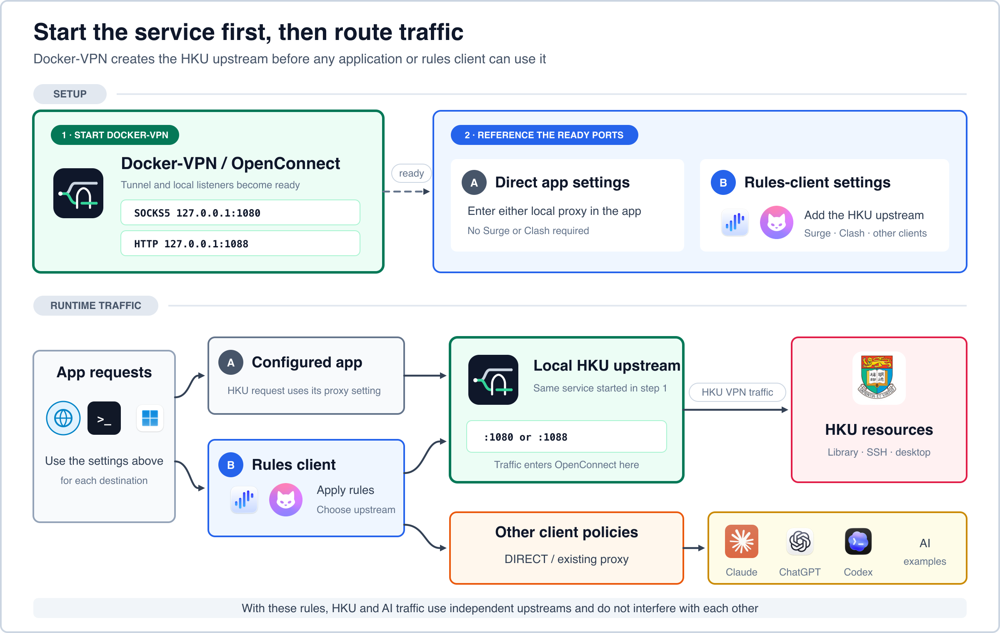
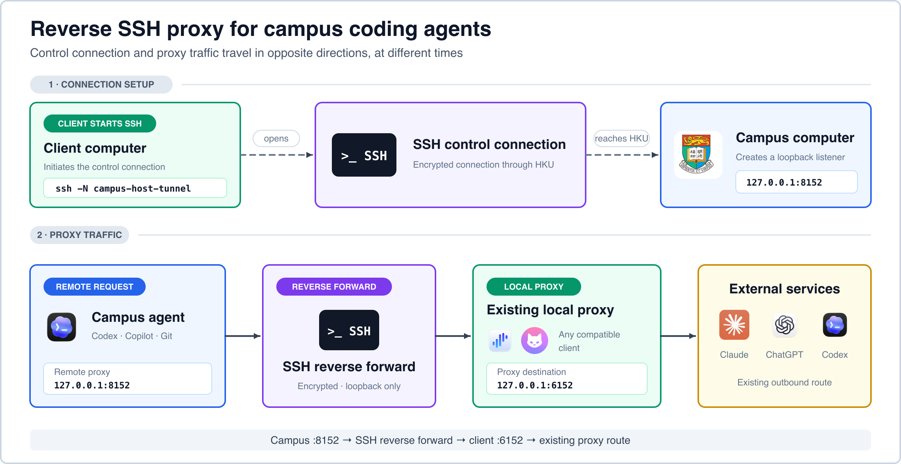

#  Docker-VPN (HKU Edition)

[Project Website](https://rqhu1995.github.io/docker-vpn/) | [English](Readme.md) | [简体中文](README.zh-CN.md)

Connect to HKU's VPN from a Docker container, then use the tunnel as a local
proxy so only the applications and destinations you choose go through HKU.

**The problem:** A system-wide Cisco AnyConnect connection hands routing control
to the VPN profile. That is inconvenient when you need HKU Library, campus SSH,
or a remote desktop while other applications must stay on your normal network
or an existing proxy service.

**The solution:** Docker-VPN runs OpenConnect in an isolated container and
exports the HKU tunnel on loopback-only SOCKS5 and HTTP ports. Point an
application directly at these ports, or reference them from an optional routing
client such as Surge or Clash. Docker-VPN does not decide how any non-HKU
traffic is routed, and the host's default route stays unchanged.

> **First-time goal:** follow [Quick Start](#quick-start) until the test command
> returns HTTP headers through HKU. Configure Clash, Surge, SSH, or remote
> desktop only after this basic connection works.

## Contents

- [Quick Start](#quick-start)
- [Use Docker-VPN](#use-docker-vpn)
- [Remote Access](#remote-access)
- [Operations and Troubleshooting](#operations-and-troubleshooting)
- [Project Reference](#project-reference)

## Quick Start

This section is the complete first-run path. You do not need a rules client to
finish it.

### Before You Begin

- An HKU account allowed to use VPN.
- Your static HKU Portal PIN and the current Microsoft Authenticator code.
- `openssl`, available by default on macOS and in common Linux distributions.
- A Docker runtime. The recommended macOS route is shown below; Docker Desktop,
  Linux Docker Engine, and Windows WSL2 are also supported.

### 1. Start Docker

Recommended on macOS:

```bash
brew install colima docker
colima start --cpu 2 --memory 2 --disk 20 --vm-type vz --mount-type virtiofs
docker info
```

Docker Desktop also works. On Linux, install Docker Engine from your
distribution or from Docker's official instructions. Windows users can run the
launcher inside WSL2 with Docker Desktop's WSL integration.

### 2. Clone and build

```bash
git clone https://github.com/rqhu1995/docker-vpn.git ~/docker-vpn
cd ~/docker-vpn
docker build -t local/vpn .
```

### 3. Create private configuration

```bash
mkdir -p ~/.vpn
cp ~/docker-vpn/examples/hku.env.example ~/.vpn/hku.env
printf '%s' 'YOUR_PORTAL_PIN' > ~/.vpn/hku.pass
chmod 600 ~/.vpn/hku.pass
```

Replace `YOUR_PORTAL_PIN` before running the third command. This file stores
your static Portal PIN, not the current six-digit Authenticator code.

Open `~/.vpn/hku.env` in a text editor, for example:

```bash
nano ~/.vpn/hku.env
```

Replace the example account:

```ini
HKU_USER=youruid@connect.hku.hk
HKU_ENDPOINT=hk
```

Use the account form HKU assigned to you. In Nano, press `Ctrl+O`, `Enter`, then
`Ctrl+X` to save and exit. Do not put the static PIN, MFA code, proxy
subscription, or private key in this repository.

### 4. Connect

Choose one command for your current location:

```bash
~/docker-vpn/bin/hkuvpn hk    # Hong Kong or overseas
~/docker-vpn/bin/hkuvpn cn    # mainland China
```

At `Response:`, enter the current six-digit Authenticator code. Keep this
terminal open while using the VPN; `Ctrl+C` stops the connection.

### 5. Confirm It Works

Open a second terminal and run:

```bash
curl -x socks5h://127.0.0.1:1080 -I https://www.hku.hk/
```

If the command returns HTTP response headers, the HKU proxy is ready. Continue
to [Use Docker-VPN](#use-docker-vpn) and choose only the integration you need.
If it fails, go directly to [Troubleshooting](#troubleshooting).

## Use Docker-VPN

### Choose an Integration

Docker-VPN is already usable after Quick Start. The remaining configuration
depends on what you want to access:

| Goal | Next step |
|---|---|
| Use HKU in one browser, terminal command, or application | [Use a Proxy Directly](#use-a-proxy-directly) |
| Add HKU as one route in Clash Verge Rev, Surge, or another client | [Add a Rules Client](#add-a-rules-client) |
| Connect to a campus computer | [SSH and Remote Desktop](#ssh-and-remote-desktop) |
| Give a campus coding agent your existing Internet proxy | [Reverse SSH for a Campus Computer](#reverse-ssh-for-a-campus-computer) |
| Keep all non-HKU traffic on its current route | Do nothing; those routes remain outside Docker-VPN |



The local listeners are:

| Protocol | Address | Purpose |
|---|---|---|
| SOCKS5 | `127.0.0.1:1080` | Preferred application and SSH proxy |
| HTTP | `127.0.0.1:1088` | HTTP/HTTPS clients without SOCKS support |

A rules client is optional. Applications, SSH, and browsers can use these ports
directly; Clash Verge Rev, Surge, and other compatible clients can reference
the same upstream while keeping their existing direct, AI proxy, and VPN
policies.

This project does not turn HKU VPN into a general anonymity service, replace
your normal Internet proxy, or bypass an organization's acceptable-use policy.

### Install the Short `hkuvpn` Command

Quick Start calls `~/docker-vpn/bin/hkuvpn` directly. For everyday use, install
the shorter `hkuvpn` command for your shell.

Zsh:

```bash
printf '\nsource ~/docker-vpn/examples/hkuvpn.zsh\n' >> ~/.zshrc
source ~/.zshrc
```

Bash:

```bash
printf '\nsource ~/docker-vpn/examples/hkuvpn.zsh\n' >> ~/.bashrc
source ~/.bashrc
```

Fish:

```fish
mkdir -p ~/.config/fish/functions
cp ~/docker-vpn/examples/hkuvpn.fish ~/.config/fish/functions/hkuvpn.fish
fish -n ~/.config/fish/functions/hkuvpn.fish
```

Do not paste the Zsh function into Fish. Fish does not use `export`,
`VAR=value command`, POSIX `case`, or POSIX function syntax.

If the clone is elsewhere, set `DOCKER_VPN_HOME`:

```bash
export DOCKER_VPN_HOME=/path/to/docker-vpn        # Zsh/Bash
```

```fish
set -Ux DOCKER_VPN_HOME /path/to/docker-vpn      # Fish
```

### Daily Commands

```bash
hkuvpn              # endpoint from ~/.vpn/hku.env
hkuvpn cn           # mainland-facing HKU endpoint
hkuvpn hk           # Hong Kong HKU endpoint
hkuvpn --status
hkuvpn --stop
hkuvpn --recover    # repair Docker/Colima only; does not request MFA
```

At `Response:`, enter the current six-digit Authenticator code. Keep the
terminal open while using the proxies. `Ctrl+C` stops the foreground container.

Endpoint guidance:

| Argument | Server | Usually appropriate when |
|---|---|---|
| `cn` | HKU's mainland-facing address | The client is in mainland China |
| `hk` | `vpn2fa.hku.hk` | The client is in Hong Kong or overseas |

Reachability is more important than geography. If certificate retrieval or TLS
fails, test the other endpoint and inspect the route selected by your existing
proxy client.

### Use a Proxy Directly

Quick checks from a second terminal:

```bash
curl -x socks5h://127.0.0.1:1080 -I https://www.hku.hk/
curl -x http://127.0.0.1:1088 -I https://www.hku.hk/
```

Use `socks5h`, not `socks5`, when DNS should also be resolved through the proxy.
The published Docker ports are TCP; do not advertise this setup as a general UDP
proxy.

Per-command proxy examples:

```bash
ALL_PROXY=socks5h://127.0.0.1:1080 curl https://lib.hku.hk/   # Zsh/Bash
```

```fish
env ALL_PROXY=socks5h://127.0.0.1:1080 curl https://lib.hku.hk/
# Or limit a variable to the current Fish block:
begin
    set -lx ALL_PROXY socks5h://127.0.0.1:1080
    curl https://lib.hku.hk/
end
```

Change host ports in `~/.vpn/hku.env` if they conflict:

```ini
HKU_SOCKS_PORT=11080
HKU_HTTP_PORT=11088
```

### Add a Rules Client

Docker-VPN only provides the local HKU upstream. A rules client is optional and
may be Clash Verge Rev, Surge, sing-box, Quantumult X, Loon, or another client
that supports a local SOCKS5/HTTP outbound and ordered rules. Start `hkuvpn` and
confirm that `1080/1088` are listening before enabling these entries.

Every client must preserve the same order:

1. Keep the HKU VPN control endpoint outside the local HKU upstream. Otherwise
   the connection tries to enter its own tunnel before that tunnel exists.
2. Send only exact campus subnets and HKU services to the HKU policy.
3. Leave all non-HKU rules and the final rule under the existing profile.

#### Clash Verge Rev / Mihomo

Clash Verge Rev uses the Mihomo core and supports Merge configurations. Create
a Merge/extension configuration for the active profile, add the contents of
[examples/clash-verge.yaml](examples/clash-verge.yaml), then re-enable that
configuration after editing it. Do not edit the downloaded subscription file;
subscription refreshes may replace it. See the official
[Clash Verge Rev Merge guide](https://clashvergerev.com/en/guide/merge) and
[Mihomo SOCKS](https://wiki.metacubex.one/en/config/proxies/socks/) and
[HTTP](https://wiki.metacubex.one/en/config/proxies/http/) outbound syntax.

The minimal Merge configuration is:

```yaml
prepend-proxies:
  - name: HKU-SOCKS5
    type: socks5
    server: 127.0.0.1
    port: 1080
    udp: false
  - name: HKU-HTTP
    type: http
    server: 127.0.0.1
    port: 1088

prepend-proxy-groups:
  - name: HKU
    type: select
    proxies: [HKU-SOCKS5, HKU-HTTP, DIRECT]
  - name: HKU-CONTROL
    type: select
    proxies: [DIRECT]

prepend-rules:
  - DOMAIN,vpn2fa.hku.hk,HKU-CONTROL
  - IP-CIDR,121.37.195.197/32,HKU-CONTROL,no-resolve
  # - IP-CIDR,192.0.2.0/24,HKU,no-resolve
  - DOMAIN-SUFFIX,hku.hk,HKU
  - DOMAIN-SUFFIX,hku.edu.hk,HKU
```

`prepend-rules` is important because rules inserted after an existing `MATCH`
rule never run. The commented `192.0.2.0/24` entry is TEST-NET-1 documentation
space; replace it with the smallest campus subnet you actually need before
enabling it. If the chosen HKU control endpoint is not directly reachable, add
the exact name of a working existing policy to `HKU-CONTROL`.

#### Surge

Merge [examples/surge.conf](examples/surge.conf) into the existing profile; do
not replace the whole profile. The equivalent minimal fragment is:

```ini
[Proxy]
HKU-SOCKS5 = socks5, 127.0.0.1, 1080
HKU-HTTP = http, 127.0.0.1, 1088

[Proxy Group]
HKU = select, HKU-SOCKS5, HKU-HTTP, EXISTING-PROXY, DIRECT
HKU-CONTROL = select, DIRECT, EXISTING-PROXY

[Rule]
DOMAIN,vpn2fa.hku.hk,HKU-CONTROL
IP-CIDR,121.37.195.197/32,HKU-CONTROL,no-resolve
# IP-CIDR,<exact-campus-subnet>,HKU,no-resolve
DOMAIN-SUFFIX,hku.hk,HKU
DOMAIN-SUFFIX,hku.edu.hk,HKU
```

Replace `EXISTING-PROXY` with the exact policy-group name from the current
profile. Choose `DIRECT` in `HKU-CONTROL` when the endpoint is directly
reachable; choose the existing policy only when that route is required and
works. Never select `HKU-SOCKS5` or `HKU-HTTP` for the control group.

`121.37.195.197/32` is the real mainland endpoint currently selected by
`hkuvpn cn`, not a sample address. Keep it aligned with
[`bin/hkuvpn`](bin/hkuvpn) if HKU changes that endpoint. Do not replace the
commented campus example with all of `10.0.0.0/8`: home, office, and container
networks commonly use that RFC 1918 range.

## Remote Access

### SSH and Remote Desktop

For a campus host that is reachable only through HKU, merge and edit
[examples/ssh_config.example](examples/ssh_config.example). The address
`192.0.2.10` below belongs to RFC 5737 TEST-NET-1 and cannot be a real campus
host; replace it with the exact IP assigned to the computer you use.

```sshconfig
Host campus-host
  HostName 192.0.2.10
  User yourname
  ProxyCommand nc -X 5 -x 127.0.0.1:1080 %h %p
  ServerAliveInterval 30
  ServerAliveCountMax 3
```

Then connect normally:

```bash
ssh campus-host
```

For remote desktop, route the exact campus destination IP through the HKU group
in the rules client's TUN/enhanced mode, or use a remote-desktop client with
SOCKS support. A process-name rule is optional and platform-specific; an exact
destination rule is more predictable.

### Reverse SSH for a Campus Computer

This is useful when a coding agent runs on a school computer but your paid proxy
subscription is usable only from the mainland client where the rules client is
running.

#### Traffic Direction



Although the option is named `RemoteForward`, the SSH control connection still
starts on the client. `-R` creates a listener on the remote computer and carries
each accepted connection back to a destination visible from the client.

#### One-Time SSH Configuration

```sshconfig
Host campus-host-tunnel
  HostName 192.0.2.10
  User yourname
  ProxyCommand nc -X 5 -x 127.0.0.1:1080 %h %p
  RemoteForward 127.0.0.1:8152 127.0.0.1:6152
  ExitOnForwardFailure yes
  ServerAliveInterval 30
  ServerAliveCountMax 3
```

The explicit remote `127.0.0.1` bind is intentional. OpenSSH also binds remote
forwarding to loopback by default, but writing it explicitly prevents this proxy
from becoming a campus-wide open proxy if server settings later change.

Start and verify:

```bash
ssh -N campus-host-tunnel
ssh campus-host 'curl -x http://127.0.0.1:8152 -I https://www.apple.com/'
```

On the remote computer, scope proxy variables to the agent when possible:

```bash
HTTP_PROXY=http://127.0.0.1:8152 \
HTTPS_PROXY=http://127.0.0.1:8152 \
NO_PROXY=localhost,127.0.0.1 \
codex
```

Fish equivalent:

```fish
begin
    set -lx HTTP_PROXY http://127.0.0.1:8152
    set -lx HTTPS_PROXY http://127.0.0.1:8152
    set -lx NO_PROXY localhost,127.0.0.1
    codex
end
```

Browser-only ChatGPT or Claude usage normally belongs on the local browser and
does not require remote forwarding. Use the tunnel when the process itself runs
on the campus computer, as with remote Codex, Copilot, package managers, or Git.

#### Keep the Tunnel Alive

```bash
brew install autossh
autossh -M 0 -N campus-host-tunnel
```

`-M 0` uses OpenSSH's own keepalives from the host block. For unattended macOS
use, place that command in a user LaunchAgent. A running `autossh` process is not
proof that the forward is healthy; verify remote `127.0.0.1:8152` with `curl`.

This design does not help if the SSH client and proxy client are also in Hong
Kong while the subscription accepts connections only from mainland China. The
proxy ingress remains the machine running port `6152`. In that topology, run the
proxy client on a reachable mainland machine/VPS or buy a supported ingress.

## Operations and Troubleshooting

### Advanced Reliability

#### OpenConnect Reconnects

The entrypoint uses verbose timestamps and a 30-minute reconnect window. Recent
failures can still end with `CSTP Dead Peer Detection detected dead peer`, TLS
read errors, `Host is unreachable`, or a rejected cookie.

A `401 Unauthorized` or rejected cookie immediately after reconnect can mean
that DNS selected a different HKU backend. Advanced users can pin one real
gateway for the session:

```ini
HKU_RESOLVE=vpn2fa.hku.hk:REAL_IP
```

Use only an IP learned from real DNS or the proxy client's real DNS cache. Do not
use `198.18.0.0/15` fake-IP results from enhanced mode. Re-check this address
when HKU changes infrastructure; a stale pin prevents connection.

#### Colima Recovery Levels

1. `docker info`: verify the host socket, not only `colima status`.
2. `hkuvpn --recover`: start/restart Colima without requesting a new MFA code.
3. `colima ssh -- docker info`: distinguish a healthy guest daemon from broken
   host socket forwarding.
4. Inspect `~/.colima/_lima/colima/ha.stderr.log` for VZ or disk-attachment
   failures.
5. Use `colima stop --force` only when the control plane is stuck. macOS may need
   one or more minutes to release the VZ disk before a restart succeeds.

Deleting the Colima VM is a last resort because it removes local images and
containers. It is not the first troubleshooting command.

#### Rules-Client Independence

Client-specific automatic reload and policy switching are intentionally not in
the portable launcher. Users of any rules client, or no rules client, must still
be able to use Docker-VPN. If you automate a client, keep these rules:

- On HKU tunnel failure, move HKU traffic to an explicit fallback such as
  `DIRECT` or an existing Hong Kong route.
- Never send `vpn2fa.hku.hk` or the mainland endpoint into `HKU-SOCKS5`.
- Restore the HKU group only after the local `1080/1088` listener and tunnel are
  confirmed healthy.

### Troubleshooting

#### No tmux/Terminal Session Remains

Check Docker first. A launcher can exit before the VPN prompt if the Colima host
socket is unavailable:

```bash
docker info
colima status
hkuvpn --recover
```

#### Certificate Retrieval Fails

Try `hkuvpn cn` and `hkuvpn hk`, check the control-endpoint rule, and remove only
the affected cache after verifying the endpoint:

```bash
rm ~/.vpn/pin-hk.cache
```

#### Port Already in Use

```bash
lsof -nP -iTCP:1080 -sTCP:LISTEN
```

Select different host ports in `~/.vpn/hku.env` and update the proxy-client
entries to match.

#### Container Is Running but a Service Fails

Test each layer separately:

```bash
docker ps --filter name=vpn-hku
hkuvpn --status
curl -x socks5h://127.0.0.1:1080 -I https://www.hku.hk/
ssh -G campus-host | grep -E 'proxycommand|hostname|port'
```

Do not treat `autossh` or `colima status` alone as an end-to-end health check.

### Security

- Proxies bind to host loopback only. Do not publish them on `0.0.0.0` without
  authentication and a firewall.
- Reverse forwarding also binds to remote loopback only. Do not enable
  `GatewayPorts yes` for this use case.
- `~/.vpn/hku.pass` is plaintext. Set mode `600` and enable disk encryption.
- Docker environment variables can be inspected by a user with Docker access.
  Treat Docker access as privileged.
- The container needs `NET_ADMIN` and `/dev/net/tun`. Review changes before
  rebuilding and do not use untrusted images.
- Keep private hostnames, campus IPs, account names, certificate caches, logs,
  subscription URLs, and SSH keys out of issues and commits.

## Project Reference

### How It Works

1. Run `hkuvpn` first. The container establishes the OpenConnect tunnel and
   exposes the loopback SOCKS5 and HTTP listeners.
2. After the listeners are ready, enter one of those addresses in an
   application, SSH configuration, browser, or optional rules client.
3. During use, requests selected by that configuration reach `1080` or `1088`,
   enter the container, and travel through the HKU AnyConnect tunnel.
4. A rules client can simultaneously send every non-HKU request to `DIRECT`, an
   existing proxy or VPN, or another policy. Those paths do not pass through
   Docker-VPN unless the user explicitly selects the HKU upstream for them.

Cisco AnyConnect is the server protocol in this design. The official Cisco
desktop client is not started for this connection; OpenConnect runs inside the
container so it cannot replace the host default route.

### Compatibility and Versions

| Area | Current support |
|---|---|
| macOS container runtime | Colima or Docker Desktop |
| Linux container runtime | Docker Engine |
| Windows | Docker Desktop with WSL2; community-tested |
| Shell | Zsh, Bash, and Fish |
| Rule-based proxy clients | Clash Verge Rev/Mihomo and Surge examples included; the same routing model applies to sing-box and similar clients |
| OpenConnect in the current `alpine:3.23` image | 9.12 |

OpenConnect runs inside the image, so a Homebrew OpenConnect installation on the
host is not used. The image follows Alpine 3.23's package. Check the
[official OpenConnect releases](https://gitlab.com/openconnect/openconnect/-/releases)
when investigating version-specific behavior.

Confirm the version actually installed in a locally built image:

```bash
docker run --rm --entrypoint openconnect local/vpn --version
```

### Portable Core and Optional Automation

The launcher, shell wrappers, routing examples, and container entrypoint are the
portable core of Docker-VPN. They do not require a rules client, tmux, or a
particular terminal application.

Users who need unattended or long-running operation can add proxy-client CLI
automation, tmux monitoring, system services such as a macOS LaunchAgent, and
diagnostic logs under `~/.vpn/logs/`. These integrations should remain optional
and machine-specific so the basic HKU proxy continues to work with other proxy
clients and Docker environments.

### Credits and Licensing

Derived from [ethack/docker-vpn](https://github.com/ethack/docker-vpn) and
adapted for HKU, OpenConnect MFA, and loopback proxy export.

This repository currently has no explicit `LICENSE` file. Do not assume that a
fork automatically grants a license. The maintainer should select a compatible
license and add the complete license text before inviting redistribution or
outside contributions.
